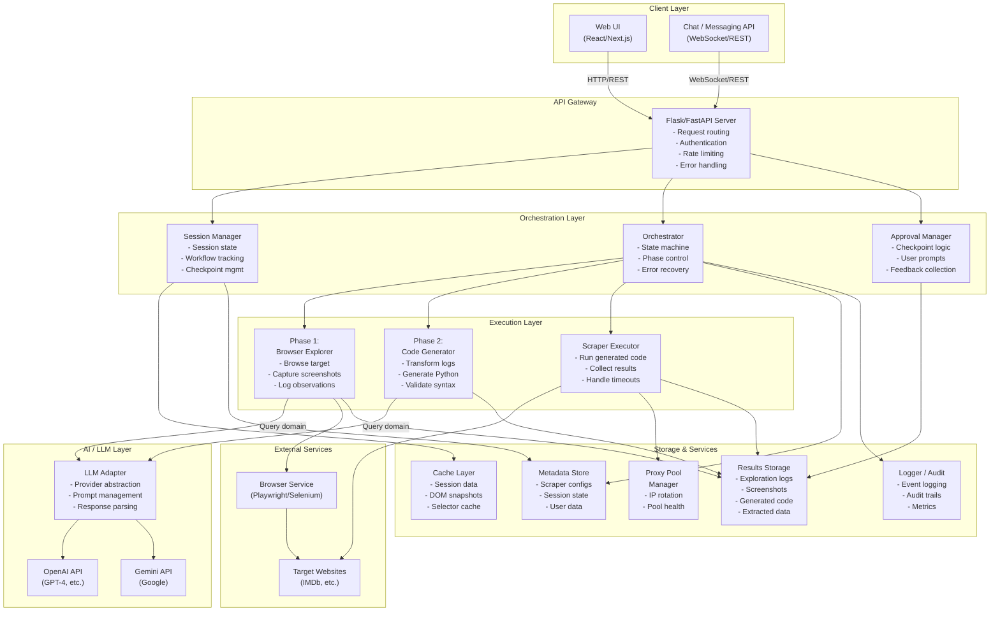
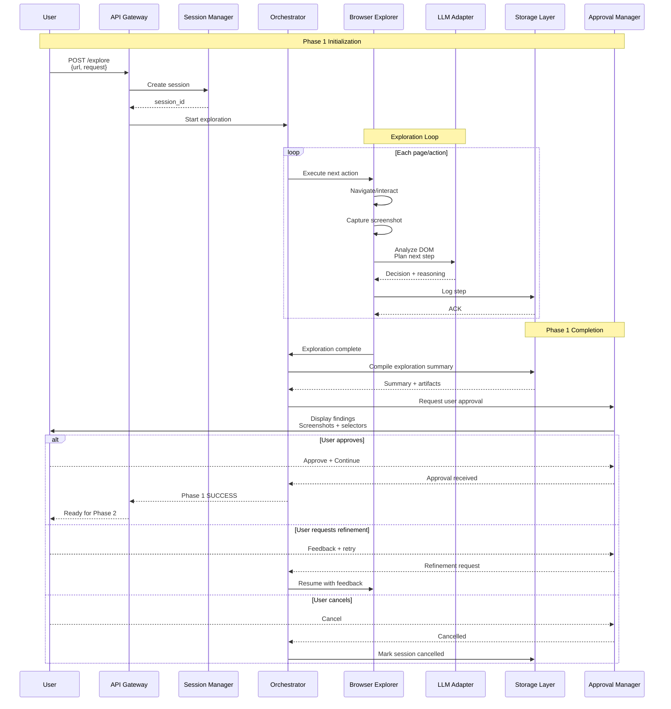
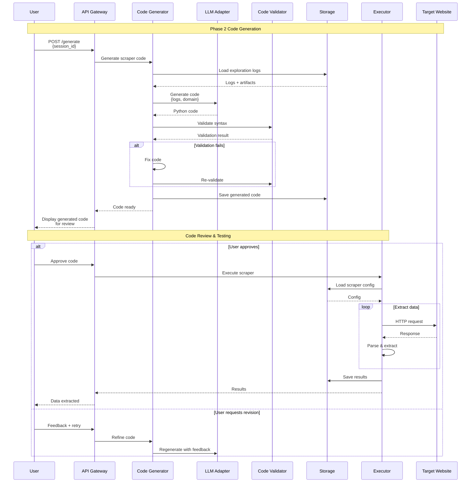
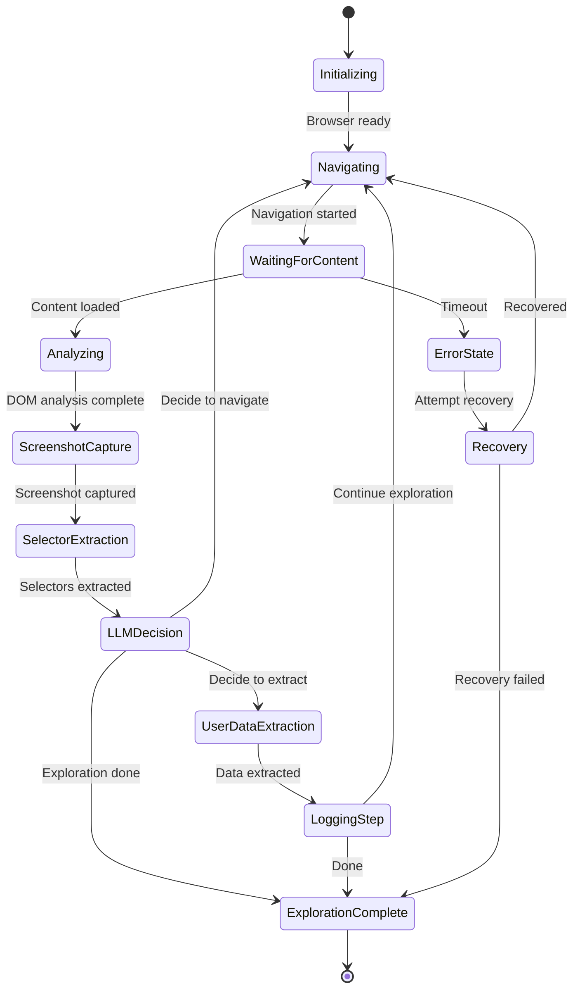
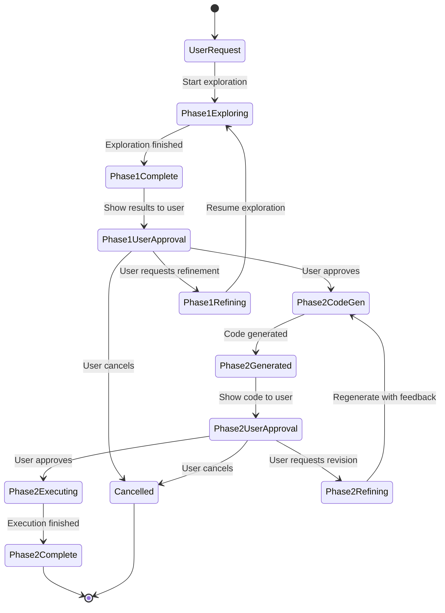
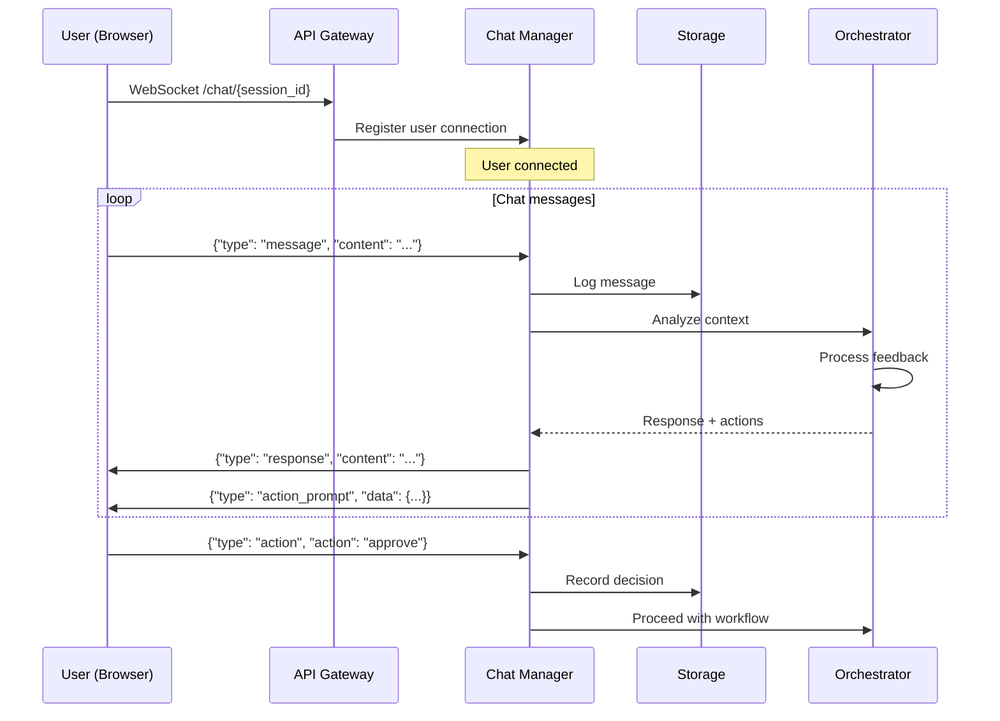

# Parser.bot Architecture Blueprint

**Document Version:** 1.0  
**Date:** December 2024  
**Status:** Reference Architecture  
**Audience:** Backend engineers, integrators, contributors

---

## Table of Contents

1. [Executive Summary](#executive-summary)
2. [High-Level System Overview](#high-level-system-overview)
3. [Component Architecture](#component-architecture)
4. [Data Flow & Sequence Diagrams](#data-flow--sequence-diagrams)
5. [API Layer](#api-layer)
6. [Browser Automation Engine](#browser-automation-engine)
7. [Orchestration Layer](#orchestration-layer)
8. [Code Generation Engine](#code-generation-engine)
9. [Approval & Chat Interface](#approval--chat-interface)
10. [Storage & Services Dependencies](#storage--services-dependencies)
11. [LLM Integration](#llm-integration)
12. [Module Breakdown](#module-breakdown)
13. [Data Contracts](#data-contracts)
14. [Configuration & Extensibility](#configuration--extensibility)
15. [Security Considerations](#security-considerations)

---

## Executive Summary

**Parser.bot** is an intelligent web scraping platform that combines natural-language processing with automated browser exploration to generate production-ready scrapers. The system architecture follows a **two-phase workflow**:

- **Phase 1 (Exploration):** Browser-use agent autonomously explores a target website, documents DOM structure, captures screenshots, and builds a mental model of the site.
- **Phase 2 (Code Generation):** LLM-powered code generator transforms exploration logs into executable, maintainable Python code.

The architecture is designed for:
- **Scalability:** Microservice-oriented with async/await patterns
- **Reliability:** Multi-checkpoint approval workflow with failure recovery
- **Extensibility:** Modular design supporting multiple LLM providers and browser automation backends
- **Observability:** Comprehensive logging and audit trails

---

## High-Level System Overview

### Architecture Layers

```
┌─────────────────────────────────────────────────────────────────────┐
│                      CLIENT LAYER                                    │
│              (Web UI / API Clients / Chat Interface)                │
└────────────────────────┬────────────────────────────────────────────┘
                         │
┌────────────────────────▼────────────────────────────────────────────┐
│                   API GATEWAY LAYER                                  │
│        (Flask/FastAPI, Authentication, Rate Limiting)              │
└────────────────────────┬────────────────────────────────────────────┘
                         │
┌────────────────────────▼────────────────────────────────────────────┐
│               ORCHESTRATION LAYER                                    │
│      (Workflow State Machine, Session Management, Approval)         │
└────────────────────────┬────────────────────────────────────────────┘
         │               │               │
         ▼               ▼               ▼
    ┌────────────┐  ┌─────────────┐  ┌──────────────┐
    │ Phase 1:   │  │ Phase 2:    │  │ LLM / Chat   │
    │ Browser    │  │ Code        │  │ Interface    │
    │ Automation │  │ Generation  │  │              │
    └────────────┘  └─────────────┘  └──────────────┘
         │               │                  │
         └───────────────┼──────────────────┘
                         │
┌────────────────────────▼────────────────────────────────────────────┐
│           STORAGE & SERVICES LAYER                                   │
│ (Metadata Store, Results Storage, Logging, Cache, LLM Providers)   │
└─────────────────────────────────────────────────────────────────────┘
```

### Key Components

| Component | Technology | Responsibility |
|-----------|-----------|-----------------|
| **API Gateway** | Flask/FastAPI (Python) | Request routing, auth, rate limiting |
| **Orchestration** | Python async, State Machine | Workflow coordination, checkpoints |
| **Browser Engine** | Browser-use + Playwright/Selenium | Headless automation, screenshot capture |
| **Code Generator** | LLM Prompting (OpenAI/Gemini) | Generate Python scraper code |
| **LLM Integration** | OpenAI API / Gemini API | Natural language understanding & generation |
| **Approval Interface** | Web UI / Chat API | User review & feedback collection |
| **Metadata Store** | PostgreSQL / DynamoDB | Scraper configs, session state, logs |
| **Results Storage** | S3 / File Storage | Exploration artifacts, generated code |
| **Cache Layer** | Redis / In-Memory | Session state, quick lookups |

---

## Component Architecture

### Component Diagram



---

## Data Flow & Sequence Diagrams

### Phase 1: Exploration Workflow Sequence



### Phase 2: Code Generation & Validation Sequence



### User Feedback Loop (Iterative Refinement)

```mermaid
sequenceDiagram
    participant User
    participant Approval as Approval Manager
    participant Orch as Orchestrator
    participant Explorer as Explorer/CodeGen
    participant LLM as LLM
    participant Storage as Storage

    loop Refinement Cycle
        Approval->>User: Display current state
        User->>Approval: Provide feedback
        Approval->>Storage: Log feedback
        
        alt Exploration phase
            Approval->>Orch: Refinement request
            Orch->>Explorer: Continue exploration<br/>with guidance
            Explorer->>LLM: Adjust strategy
            Explorer-->>Orch: New findings
            Orch->>Storage: Update logs
        else Code generation phase
            Approval->>Orch: Code revision request
            Orch->>Explorer: Regenerate with<br/>new constraints
            Explorer->>LLM: Generate revised code
            Explorer-->>Orch: New code
            Orch->>Storage: Save revised code
        end
        
        Approval->>User: Display refined results
        alt User satisfied
            User-->>Approval: Approve
            break
        end
    end
```

---

## API Layer

### Core REST Endpoints

```python
# Exploration Phase
POST   /api/v1/explore                 # Start exploration session
GET    /api/v1/explore/{session_id}    # Get exploration status
POST   /api/v1/explore/{session_id}/approve    # Approve exploration
POST   /api/v1/explore/{session_id}/refine     # Request refinement
GET    /api/v1/explore/{session_id}/logs       # Retrieve exploration logs
GET    /api/v1/explore/{session_id}/screenshots # List screenshots

# Code Generation Phase
POST   /api/v1/generate/{session_id}   # Generate scraper code
GET    /api/v1/generate/{session_id}   # Get generated code
POST   /api/v1/generate/{session_id}/validate # Validate generated code
POST   /api/v1/generate/{session_id}/test     # Test generated code
POST   /api/v1/generate/{session_id}/approve  # Approve code

# Execution Phase
POST   /api/v1/execute/{scraper_id}    # Run scraper
GET    /api/v1/execute/{job_id}/status # Check execution status
GET    /api/v1/execute/{job_id}/results # Retrieve results

# Chat / Approval Interface
WebSocket /api/v1/chat/{session_id}    # Real-time chat interface
POST   /api/v1/feedback/{session_id}   # Submit structured feedback
```

### Request/Response Examples

**Exploration Request:**
```json
POST /api/v1/explore
{
  "url": "https://www.imdb.com",
  "request": "Extract top 50 highest-rated movies with title, year, rating, director, cast, plot",
  "constraints": {
    "max_page_visits": 10,
    "timeout_seconds": 300,
    "screenshot_enabled": true
  }
}
```

**Code Generation Request:**
```json
POST /api/v1/generate/session_123abc
{
  "output_format": "python_script",
  "include_tests": true,
  "documentation": "comprehensive"
}
```

---

## Browser Automation Engine

### Architecture

```
┌──────────────────────────────────────────────┐
│      Browser Automation Engine               │
├──────────────────────────────────────────────┤
│                                              │
│  ┌────────────────────────────────────────┐ │
│  │ Browser-use Agent Controller           │ │
│  │ - Action planning                      │ │
│  │ - State tracking                       │ │
│  │ - Error recovery                       │ │
│  └────────────────────────────────────────┘ │
│                   │                          │
│                   ▼                          │
│  ┌────────────────────────────────────────┐ │
│  │ Playwright/Selenium Wrapper            │ │
│  │ - Launch browser context               │ │
│  │ - Navigate pages                       │ │
│  │ - Execute scripts                      │ │
│  │ - Capture screenshots                  │ │
│  └────────────────────────────────────────┘ │
│                   │                          │
│                   ▼                          │
│  ┌────────────────────────────────────────┐ │
│  │ DOM Parser & Selector Extractor        │ │
│  │ - Parse HTML/DOM                       │ │
│  │ - Generate CSS selectors               │ │
│  │ - Extract text/attributes              │ │
│  │ - Find interactive elements            │ │
│  └────────────────────────────────────────┘ │
│                   │                          │
│                   ▼                          │
│  ┌────────────────────────────────────────┐ │
│  │ LLM-Driven Decision Making             │ │
│  │ - Analyze page content                 │ │
│  │ - Plan exploration path                │ │
│  │ - Identify data extraction points      │ │
│  │ - Handle edge cases                    │ │
│  └────────────────────────────────────────┘ │
│                                              │
└──────────────────────────────────────────────┘
```

### Browser Agent State Machine



### Key Browser-use Actions

```python
class BrowserAction(Enum):
    NAVIGATE = "navigate"           # Go to URL
    CLICK = "click"                 # Click element
    TYPE = "type"                   # Type text
    SCROLL = "scroll"               # Scroll page
    WAIT = "wait"                   # Wait for condition
    SCREENSHOT = "screenshot"       # Capture screen
    EXTRACT_TEXT = "extract_text"   # Get text content
    EXTRACT_JSON_LD = "extract_json_ld"  # Parse structured data
    FILL_FORM = "fill_form"         # Fill form fields
    SUBMIT_FORM = "submit_form"     # Submit form
```

---

## Orchestration Layer

### Session & State Management

```python
class ExplorationSession:
    """Tracks exploration phase state"""
    session_id: str
    user_request: str
    target_url: str
    status: SessionStatus  # RUNNING, PENDING_APPROVAL, APPROVED, etc.
    
    exploration_logs: List[ExplorationLog]
    screenshots: List[Screenshot]
    discovered_selectors: Dict[str, str]
    
    created_at: datetime
    approved_at: Optional[datetime]
    exploration_end_at: Optional[datetime]
    
    metadata: Dict  # Extensible storage

class CodeGenerationSession:
    """Tracks code generation phase state"""
    exploration_session_id: str
    generated_code: str
    validation_result: ValidationResult
    test_results: Optional[TestResult]
    
    status: CodeGenStatus  # GENERATED, VALIDATED, APPROVED, etc.
    created_at: datetime
    metadata: Dict
```

### Workflow State Machine



### Checkpoint Manager

The Orchestration layer enforces approval checkpoints:

1. **Checkpoint 1 (Phase 1):** After exploration completes
   - Display: Screenshots, discovered selectors, confidence metrics
   - User options: Approve, Refine, Cancel

2. **Checkpoint 2 (Phase 2):** After code generation
   - Display: Generated code, syntax validation, test results
   - User options: Approve, Refine, Cancel

3. **Checkpoint 3 (Execution):** Before production execution
   - Display: Execution plan, sample data
   - User options: Execute, Cancel

---

## Code Generation Engine

### Architecture

```
┌──────────────────────────────────────────────┐
│      Code Generation Engine                  │
├──────────────────────────────────────────────┤
│                                              │
│  ┌────────────────────────────────────────┐ │
│  │ Log Loader & Parser                    │ │
│  │ - Load YAML exploration logs           │ │
│  │ - Parse discovered selectors           │ │
│  │ - Extract decision paths               │ │
│  └────────────────────────────────────────┘ │
│                   │                          │
│                   ▼                          │
│  ┌────────────────────────────────────────┐ │
│  │ Prompt Constructor                     │ │
│  │ - Build LLM prompt with logs           │ │
│  │ - Include constraints & examples       │ │
│  │ - Format with code generation context  │ │
│  └────────────────────────────────────────┘ │
│                   │                          │
│                   ▼                          │
│  ┌────────────────────────────────────────┐ │
│  │ LLM Code Generator                     │ │
│  │ - Call OpenAI / Gemini API             │ │
│  │ - Generate Python scraper code         │ │
│  │ - Include documentation                │ │
│  └────────────────────────────────────────┘ │
│                   │                          │
│                   ▼                          │
│  ┌────────────────────────────────────────┐ │
│  │ Code Validator                         │ │
│  │ - Syntax validation (ast.parse)        │ │
│  │ - Security checks (sandboxing check)   │ │
│  │ - Import verification                  │ │
│  │ - Type hint validation                 │ │
│  └────────────────────────────────────────┘ │
│                   │                          │
│                   ▼                          │
│  ┌────────────────────────────────────────┐ │
│  │ Code Formatter & Documentation         │ │
│  │ - Apply PEP 8 formatting               │ │
│  │ - Add docstrings                       │ │
│  │ - Generate README                      │ │
│  └────────────────────────────────────────┘ │
│                                              │
└──────────────────────────────────────────────┘
```

### Generated Code Structure

```python
"""
{domain} Scraper

Generated: {timestamp}
Phase: Code Generation from Exploration Logs

This scraper extracts {field list} from {domain}.
It was automatically generated from exploration phase discoveries.
"""

import json
import time
from dataclasses import dataclass
from typing import List, Optional, Dict
from datetime import datetime

import requests
from bs4 import BeautifulSoup

# ============================================================================
# CONFIGURATION
# ============================================================================

BASE_URL = "{base_url}"
SELECTORS = {discovered_selectors}
USER_AGENT = "{user_agent}"
HEADERS = {default_headers}

# ============================================================================
# DATA MODELS
# ============================================================================

@dataclass
class ExtractedData:
    """Container for extracted data"""
    # Fields from exploration
    pass

# ============================================================================
# SCRAPING FUNCTIONS
# ============================================================================

def fetch_page(url: str) -> Optional[str]:
    """Fetch page content with error handling"""
    pass

def extract_list(html: str) -> List[Dict]:
    """Extract main list items"""
    pass

def extract_details(html: str) -> Dict:
    """Extract detail page information"""
    pass

def main():
    """Main execution"""
    pass

if __name__ == "__main__":
    main()
```

---

## Approval & Chat Interface

### Real-time Communication



### Approval Prompt Format

```json
{
  "type": "approval_request",
  "checkpoint": "phase_1_exploration",
  "summary": {
    "status": "completed",
    "pages_visited": 3,
    "selectors_found": 7,
    "confidence": 0.95
  },
  "findings": {
    "main_list_url": "https://example.com/list",
    "detail_url_template": "https://example.com/item/{id}",
    "selectors": {
      "list_item": "div.item",
      "item_title": "span.title"
    }
  },
  "artifacts": {
    "screenshots": ["step_1.png", "step_2.png"],
    "full_log": "session_log.yaml"
  },
  "options": ["approve", "refine", "cancel"],
  "refinement_prompts": [
    "Visit more detail pages to verify consistency",
    "Explore pagination behavior"
  ]
}
```

---

## Storage & Services Dependencies

### Database Schema Overview

```sql
-- Sessions table
CREATE TABLE sessions (
    id UUID PRIMARY KEY,
    user_id UUID NOT NULL,
    workflow_type ENUM ('exploration', 'generation', 'execution'),
    status ENUM ('running', 'pending_approval', 'approved', 'completed', 'failed'),
    created_at TIMESTAMP,
    updated_at TIMESTAMP
);

-- Exploration logs table
CREATE TABLE exploration_logs (
    id UUID PRIMARY KEY,
    session_id UUID NOT NULL REFERENCES sessions(id),
    step_number INT,
    timestamp TIMESTAMP,
    action_type VARCHAR(50),
    url VARCHAR(2048),
    selectors_found JSONB,
    observations JSONB,
    screenshot_path VARCHAR(1024),
    created_at TIMESTAMP
);

-- Generated code table
CREATE TABLE generated_code (
    id UUID PRIMARY KEY,
    session_id UUID NOT NULL REFERENCES sessions(id),
    code_content TEXT,
    syntax_valid BOOLEAN,
    validation_result JSONB,
    created_at TIMESTAMP
);

-- Execution results table
CREATE TABLE execution_results (
    id UUID PRIMARY KEY,
    scraper_id UUID NOT NULL,
    job_id UUID NOT NULL UNIQUE,
    status ENUM ('running', 'completed', 'failed'),
    extracted_data JSONB,
    error_message TEXT,
    started_at TIMESTAMP,
    completed_at TIMESTAMP
);
```

### Storage Tiers

| Data Type | Storage | TTL | Purpose |
|-----------|---------|-----|---------|
| **Session state** | PostgreSQL | 30 days | Active workflow tracking |
| **Exploration logs** | PostgreSQL + S3 | 30 days | Audit trail + artifact refs |
| **Screenshots** | S3 / Blob Storage | 7 days | Visual reference for review |
| **Generated code** | S3 + PostgreSQL | 90 days | Archive of generated scrapers |
| **Execution results** | S3 | 180 days | Data archive |
| **Cache (DOM snapshots)** | Redis | 1 hour | Quick DOM access during exploration |
| **Session data** | Redis | Session | In-memory state |

---

## LLM Integration

### Adapter Pattern

```python
from abc import ABC, abstractmethod

class LLMProvider(ABC):
    """Abstract base for LLM providers"""
    
    @abstractmethod
    def generate_code(self, logs: ExplorationLogs, constraints: Dict) -> str:
        """Generate Python scraper code from logs"""
        pass
    
    @abstractmethod
    def analyze_dom(self, html: str, query: str) -> Dict:
        """Analyze DOM and answer query"""
        pass
    
    @abstractmethod
    def decide_next_action(self, observations: List[str]) -> str:
        """Decide exploration next step"""
        pass

class OpenAIProvider(LLMProvider):
    """OpenAI GPT-4 implementation"""
    
    def __init__(self, api_key: str, model: str = "gpt-4"):
        self.api_key = api_key
        self.model = model
    
    def generate_code(self, logs: ExplorationLogs, constraints: Dict) -> str:
        prompt = self._build_code_gen_prompt(logs, constraints)
        response = openai.ChatCompletion.create(
            model=self.model,
            messages=[{"role": "user", "content": prompt}],
            temperature=0.2,
            max_tokens=4000
        )
        return response.choices[0].message.content

class GeminiProvider(LLMProvider):
    """Google Gemini implementation"""
    
    def __init__(self, api_key: str, model: str = "gemini-pro"):
        self.api_key = api_key
        self.model = model
    
    # Similar implementation for Gemini API
    pass

class LLMFactory:
    """Factory for provider instantiation"""
    
    @staticmethod
    def create(provider: str, config: Dict) -> LLMProvider:
        if provider == "openai":
            return OpenAIProvider(**config)
        elif provider == "gemini":
            return GeminiProvider(**config)
        else:
            raise ValueError(f"Unknown provider: {provider}")
```

### Prompting Strategy

**Phase 1 (Exploration) Prompt:**
```
You are a web scraping agent. Your task is to explore {target_url} and find:
- {user_request_fields}

Current observations:
- {page_analysis}
- {current_dom_snapshot}

Decision rules:
1. Identify extraction points for required fields
2. Determine if pagination or multi-page navigation is needed
3. Estimate confidence in data extraction capability
4. Plan next exploratory action

Your response should include:
1. Analysis of current page
2. Confidence score (0-1)
3. Next action recommendation
4. Any CSS/XPath selectors discovered
```

**Phase 2 (Code Generation) Prompt:**
```
Based on these exploration logs from a target website:
{formatted_exploration_logs}

Generate a production-ready Python scraper that:
1. Fetches the main list page
2. Extracts required fields using discovered selectors
3. Handles pagination/multi-page scenarios
4. Includes error handling and timeouts
5. Returns structured data as JSON

Requirements:
- Use requests + BeautifulSoup for scraping
- Include comprehensive error handling
- Add docstrings and comments
- Follow PEP 8 style
- Target: {max_lines} lines max

Code:
```

---

## Module Breakdown

### Core Modules

```
parser.bot/
├── __init__.py
├── config.py                    # Configuration management
├── models.py                    # Data models & types
├── logging.py                   # Centralized logging
│
├── api/
│   ├── __init__.py
│   ├── routes.py               # Flask/FastAPI endpoints
│   ├── middleware.py           # Auth, rate limiting
│   ├── handlers.py             # Request handlers
│   └── websocket.py            # Chat interface
│
├── orchestration/
│   ├── __init__.py
│   ├── session_manager.py      # Session lifecycle
│   ├── state_machine.py        # Workflow state machine
│   ├── approval_manager.py     # Checkpoint logic
│   └── workflow.py             # Main orchestration
│
├── exploration/
│   ├── __init__.py
│   ├── agent.py                # Browser-use agent
│   ├── browser_wrapper.py      # Playwright/Selenium wrapper
│   ├── dom_parser.py           # DOM parsing & selector extraction
│   ├── decision_maker.py       # LLM-driven decisions
│   └── logger.py               # Exploration logging
│
├── codegen/
│   ├── __init__.py
│   ├── generator.py            # Code generation engine
│   ├── prompt_builder.py       # Prompt construction
│   ├── formatter.py            # Code formatting & docs
│   ├── validator.py            # Code validation
│   └── templates/
│       ├── base_scraper.py.j2  # Jinja2 template
│       └── requirements.txt.j2
│
├── executor/
│   ├── __init__.py
│   ├── executor.py             # Code execution manager
│   ├── sandbox.py              # Execution sandboxing
│   └── result_processor.py     # Result transformation
│
├── llm/
│   ├── __init__.py
│   ├── provider.py             # Abstract provider
│   ├── openai_provider.py      # OpenAI implementation
│   ├── gemini_provider.py      # Gemini implementation
│   └── prompt_templates.py     # Prompt templates
│
├── storage/
│   ├── __init__.py
│   ├── database.py             # ORM/database layer
│   ├── file_storage.py         # S3/blob storage
│   ├── cache.py                # Redis cache
│   └── models.py               # Storage models
│
├── chat/
│   ├── __init__.py
│   ├── manager.py              # Chat state management
│   ├── message_handler.py      # Message routing
│   └── approval_prompts.py     # Checkpoint prompts
│
└── utils/
    ├── __init__.py
    ├── validators.py           # Input validation
    ├── exceptions.py           # Custom exceptions
    ├── serializers.py          # JSON serializers
    └── helpers.py              # Utility functions
```

### Key Classes

```python
# Orchestration
class Orchestrator:
    """Main workflow coordinator"""
    async def start_exploration(session_id: str) -> None
    async def handle_approval(session_id: str, action: str) -> None
    async def start_code_generation(session_id: str) -> None
    async def execute_scraper(session_id: str) -> Dict

# Exploration
class BrowserExplorer:
    """Autonomous browser agent"""
    async def explore(url: str, request: str) -> ExplorationResult
    async def navigate(url: str) -> Screenshot
    async def analyze_dom() -> DOMAnalysis
    async def log_step(log: ExplorationLog) -> None

# Code Generation
class CodeGenerator:
    """Transforms logs to executable code"""
    def generate_code(logs: ExplorationLogs) -> str
    def validate_code(code: str) -> ValidationResult
    def format_code(code: str) -> str

# Storage
class SessionStore:
    """Session persistence"""
    async def create_session(user_id: str) -> str
    async def get_session(session_id: str) -> Session
    async def save_session(session: Session) -> None
    async def delete_session(session_id: str) -> None

class ExplorationLogStore:
    """Exploration artifact storage"""
    async def append_log(session_id: str, log: ExplorationLog) -> None
    async def get_logs(session_id: str) -> List[ExplorationLog]
    async def save_screenshot(session_id: str, path: str) -> None
```

---

## Data Contracts

### Exploration Log Format

```yaml
# logs/exploration/session_log.yaml
session_id: "uuid-12345"
user_request: "Extract movie data from IMDb"
target_url: "https://www.imdb.com"
started_at: "2024-12-10T10:15:00Z"
completed_at: "2024-12-10T10:22:00Z"

steps:
  - step_number: 1
    timestamp: "2024-12-10T10:15:30Z"
    action: "navigate"
    url: "https://www.imdb.com/chart/top250/"
    
    dom_analysis:
      title: "Top 250 Movies"
      layout_type: "table"
      interactive_elements: ["link", "button"]
    
    selectors_discovered:
      main_container: "table.imdbTable"
      row: "table.imdbTable tbody tr"
      title: "td.titleColumn a"
      rating: "span.sc-2dddff0-0"
    
    observations:
      - "Page displays 250 entries in paginated table"
      - "Each row contains: rank, title, year, rating"
      - "No JavaScript rendering required"
    
    decision:
      confidence: 0.95
      next_action: "navigate_to_detail"
      reasoning: "Found consistent structure, need to verify detail pages"
    
    screenshot: "screenshots/step_1_top250.png"
    
    metadata:
      page_load_time_ms: 2340
      dom_node_count: 1250
      json_ld_found: false

summary:
  total_steps: 3
  pages_visited: 3
  selectors_discovered: 7
  final_confidence: 0.95
  exploration_time_seconds: 420
  screenshots_captured: 3
```

### Agent Message Format

```json
{
  "type": "exploration_step",
  "session_id": "uuid-12345",
  "timestamp": "2024-12-10T10:16:45Z",
  
  "agent_state": {
    "current_url": "https://www.imdb.com/title/tt0111161/",
    "visited_urls": ["https://www.imdb.com", "https://www.imdb.com/chart/top250/"],
    "steps_taken": 2,
    "confidence_score": 0.92
  },
  
  "action": {
    "type": "extract_json_ld",
    "selector": "script[type='application/ld+json']",
    "result": {
      "name": "The Shawshank Redemption",
      "datePublished": "1994",
      "director": [{"name": "Frank Darabont"}],
      "actor": [
        {"name": "Tim Robbins"},
        {"name": "Morgan Freeman"},
        {"name": "Bob Gunton"}
      ]
    }
  },
  
  "llm_analysis": {
    "page_structure": "detail_page",
    "data_availability": "complete",
    "extraction_method": "json_ld_parse",
    "confidence": 0.98,
    "next_step_options": [
      "return_to_list_and_sample_more",
      "complete_exploration"
    ]
  },
  
  "screenshot": {
    "path": "screenshots/step_2_detail.png",
    "highlighted_elements": ["script[type='application/ld+json']"]
  }
}
```

### Scraper Artifact Format

```json
{
  "scraper_id": "scraper-imdb-top-movies",
  "generation_timestamp": "2024-12-10T10:25:00Z",
  "source_session": "uuid-12345",
  
  "metadata": {
    "target_domain": "imdb.com",
    "fields": ["title", "year", "rating", "director", "cast", "plot"],
    "estimated_execution_time_seconds": 60,
    "dependencies": ["requests", "beautifulsoup4"]
  },
  
  "generated_code": {
    "language": "python",
    "path": "generated_scrapers/imdb_top_movies.py",
    "size_lines": 450,
    "syntax_valid": true,
    "validation_results": {
      "imports_ok": true,
      "security_check": "passed",
      "type_hints": "present"
    }
  },
  
  "discovery_summary": {
    "main_list_url": "https://www.imdb.com/chart/top250/",
    "detail_url_template": "https://www.imdb.com/title/{movie_id}/",
    "selectors": {
      "list_container": "table.imdbTable tbody",
      "row": "tr",
      "title": "td.titleColumn a",
      "rating": "span.sc-2dddff0-0"
    },
    "pagination": {
      "type": "none_in_main_list",
      "required_for_details": false
    }
  }
}
```

---

## Configuration & Extensibility

### Environment Configuration

```python
# config.py
import os
from typing import Optional

class Config:
    """Base configuration"""
    FLASK_ENV = os.getenv("FLASK_ENV", "development")
    DEBUG = FLASK_ENV == "development"
    
    # API Configuration
    API_HOST = os.getenv("API_HOST", "0.0.0.0")
    API_PORT = int(os.getenv("API_PORT", "5000"))
    
    # Database
    DATABASE_URL = os.getenv("DATABASE_URL", "postgresql://localhost/parser")
    SQLALCHEMY_TRACK_MODIFICATIONS = False
    
    # Storage
    STORAGE_TYPE = os.getenv("STORAGE_TYPE", "s3")  # s3 or local
    S3_BUCKET = os.getenv("S3_BUCKET", "parser-bot-artifacts")
    LOCAL_STORAGE_PATH = os.getenv("LOCAL_STORAGE_PATH", "./storage")
    
    # Cache
    REDIS_URL = os.getenv("REDIS_URL", "redis://localhost:6379")
    CACHE_TTL_SECONDS = int(os.getenv("CACHE_TTL_SECONDS", "3600"))
    
    # LLM Configuration
    LLM_PROVIDER = os.getenv("LLM_PROVIDER", "openai")  # openai or gemini
    LLM_API_KEY = os.getenv("LLM_API_KEY")
    LLM_MODEL = os.getenv("LLM_MODEL", "gpt-4")
    LLM_TEMPERATURE = float(os.getenv("LLM_TEMPERATURE", "0.2"))
    LLM_MAX_TOKENS = int(os.getenv("LLM_MAX_TOKENS", "4000"))
    
    # Exploration
    BROWSER_TYPE = os.getenv("BROWSER_TYPE", "chromium")  # chromium, firefox
    MAX_EXPLORATION_STEPS = int(os.getenv("MAX_EXPLORATION_STEPS", "10"))
    EXPLORATION_TIMEOUT_SECONDS = int(os.getenv("EXPLORATION_TIMEOUT_SECONDS", "300"))
    SCREENSHOT_ENABLED = os.getenv("SCREENSHOT_ENABLED", "true").lower() == "true"
    
    # Security
    AUTH_ENABLED = os.getenv("AUTH_ENABLED", "true").lower() == "true"
    RATE_LIMIT_ENABLED = os.getenv("RATE_LIMIT_ENABLED", "true").lower() == "true"
    REQUESTS_PER_MINUTE = int(os.getenv("REQUESTS_PER_MINUTE", "60"))
    
    # Logging
    LOG_LEVEL = os.getenv("LOG_LEVEL", "INFO")
    LOG_FORMAT = os.getenv("LOG_FORMAT", "json")  # json or text
```

### Provider Plugin Architecture

To add a new LLM provider:

```python
# llm/custom_provider.py
from llm.provider import LLMProvider

class CustomLLMProvider(LLMProvider):
    """Custom LLM implementation"""
    
    def __init__(self, api_key: str, model: str = "custom-model"):
        self.api_key = api_key
        self.model = model
    
    def generate_code(self, logs: ExplorationLogs, constraints: Dict) -> str:
        # Implementation specific to custom provider
        pass
    
    def analyze_dom(self, html: str, query: str) -> Dict:
        # Implementation
        pass
    
    def decide_next_action(self, observations: List[str]) -> str:
        # Implementation
        pass

# Register in factory
LLMFactory.register("custom", CustomLLMProvider)
```

### Browser Backend Pluggability

```python
# exploration/browser_wrapper.py
from abc import ABC, abstractmethod

class BrowserBackend(ABC):
    """Abstract browser backend"""
    
    @abstractmethod
    async def launch(self) -> None
    
    @abstractmethod
    async def navigate(self, url: str) -> str
    
    @abstractmethod
    async def screenshot(self) -> bytes
    
    @abstractmethod
    async def click(self, selector: str) -> None
    
    @abstractmethod
    async def close(self) -> None

class PlaywrightBackend(BrowserBackend):
    """Playwright implementation"""
    pass

class SeleniumBackend(BrowserBackend):
    """Selenium WebDriver implementation"""
    pass
```

---

## Security Considerations

### Input Validation

```python
# utils/validators.py
from urllib.parse import urlparse
import re

class URLValidator:
    """Validate and sanitize URLs"""
    
    ALLOWED_SCHEMES = ["http", "https"]
    MAX_URL_LENGTH = 2048
    
    @staticmethod
    def validate(url: str) -> bool:
        """Validate URL format and scheme"""
        if len(url) > URLValidator.MAX_URL_LENGTH:
            return False
        
        parsed = urlparse(url)
        if parsed.scheme not in URLValidator.ALLOWED_SCHEMES:
            return False
        
        if not parsed.netloc:
            return False
        
        return True

class RequestValidator:
    """Validate user requests"""
    
    MAX_REQUEST_LENGTH = 5000
    FORBIDDEN_KEYWORDS = ["exec", "eval", "__import__"]
    
    @staticmethod
    def validate(request: str) -> bool:
        """Check request for malicious content"""
        if len(request) > RequestValidator.MAX_REQUEST_LENGTH:
            return False
        
        for keyword in RequestValidator.FORBIDDEN_KEYWORDS:
            if keyword in request.lower():
                return False
        
        return True
```

### Code Sandbox Execution

```python
# executor/sandbox.py
import ast
import tempfile
import subprocess

class CodeSandbox:
    """Execute scraper code in isolated environment"""
    
    FORBIDDEN_MODULES = ["os", "sys", "subprocess", "socket"]
    TIMEOUT_SECONDS = 300
    
    @staticmethod
    def validate_code_safety(code: str) -> tuple[bool, str]:
        """Static analysis of code before execution"""
        try:
            tree = ast.parse(code)
            
            for node in ast.walk(tree):
                if isinstance(node, ast.Import):
                    for alias in node.names:
                        if alias.name.split('.')[0] in CodeSandbox.FORBIDDEN_MODULES:
                            return False, f"Forbidden module: {alias.name}"
                
                if isinstance(node, ast.ImportFrom):
                    if node.module.split('.')[0] in CodeSandbox.FORBIDDEN_MODULES:
                        return False, f"Forbidden module: {node.module}"
            
            return True, "Code is safe"
        
        except SyntaxError as e:
            return False, f"Syntax error: {e}"
    
    @staticmethod
    async def execute_safely(code: str, timeout: int = 300) -> Dict:
        """Execute code with timeout and resource limits"""
        # Implementation using subprocess with resource limits
        pass
```

### Audit Logging

```python
# logging.py
import logging
import json
from datetime import datetime

class AuditLogger:
    """Centralized audit logging"""
    
    def __init__(self):
        self.logger = logging.getLogger("audit")
    
    def log_action(self, user_id: str, action: str, resource: str, details: Dict) -> None:
        """Log user actions for audit trail"""
        audit_entry = {
            "timestamp": datetime.utcnow().isoformat(),
            "user_id": user_id,
            "action": action,
            "resource": resource,
            "details": details
        }
        self.logger.info(json.dumps(audit_entry))
    
    def log_code_generation(self, session_id: str, code_hash: str, approved: bool) -> None:
        """Log code generation events"""
        self.log_action(
            user_id="system",
            action="code_generated",
            resource=session_id,
            details={"code_hash": code_hash, "approved": approved}
        )
```

---

## Phase 1 Workflow Reference

This architecture blueprint implements the **two-phase workflow** detailed in [docs/parsebot_workflow_example.md](docs/parsebot_workflow_example.md):

- **Phase 1 (Exploration):** Browser-use agent autonomously explores target website, documents structure, captures evidence (screenshots, selectors)
- **Phase 2 (Code Generation):** LLM transforms exploration artifacts into production Python code

The approval manager enforces checkpoints at Phase 1 completion and Phase 2 code review stages, allowing for iterative refinement with user feedback.

---

## Extensibility Roadmap

### Future Enhancements

1. **Multi-Provider LLM Balancing:** Load balance across multiple LLM providers for cost optimization
2. **Advanced DOM Understanding:** Integrate vision models (GPT-4V) for screenshot-based selector generation
3. **Distributed Execution:** Scale Phase 1 across multiple browser instances for parallel exploration
4. **Custom Selector Patterns:** Support custom regex/XPath patterns in user feedback
5. **Integration Marketplace:** Plugin system for storage backends, authentication providers
6. **Advanced Code Optimization:** Post-generation code optimization for performance
7. **Real-time DOM Diffing:** Track DOM changes to auto-detect when scrapers need updates
8. **Dataset Quality Metrics:** Built-in data validation and quality scoring

---

## Conclusion

This architecture provides a scalable, observable, and extensible foundation for building intelligent web scrapers. The modular design enables teams to:

- **Implement incrementally:** Start with core exploration and code generation
- **Scale independently:** Add distributed workers, additional LLM providers as needed
- **Customize workflows:** Extend approval checkpoints, add domain-specific logic
- **Monitor comprehensively:** Full audit trails and event logging throughout execution

Refer to [docs/parsebot_workflow_example.md](docs/parsebot_workflow_example.md) for detailed Phase 1/2 implementation examples.

---

## Document Revision History

| Version | Date | Author | Changes |
|---------|------|--------|---------|
| 1.0 | Dec 2024 | AI Architecture Team | Initial blueprint |

---

**For questions or clarifications, contact the engineering team.**
